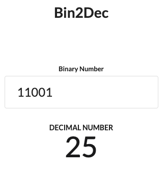

# Bin2Dec
2進数を10進数に変換します。

デモURL:
[https://bin2dec-sumomo-99.vercel.app/](https://bin2dec-sumomo-99.vercel.app/)



## はじめかた
### 開発サーバの起動

```bash
npm run dev
```

ブラウザで [http://localhost:3000](http://localhost:3000) にアクセスします。

### ビルド

```bash
npm run build
```